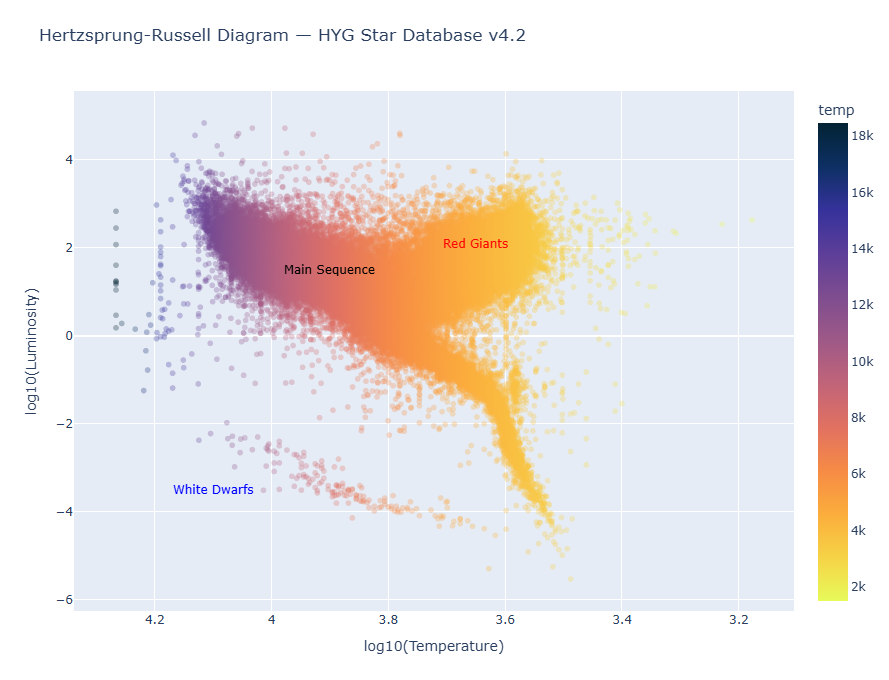
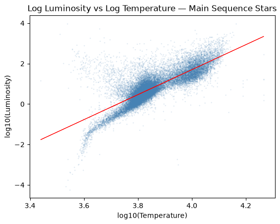
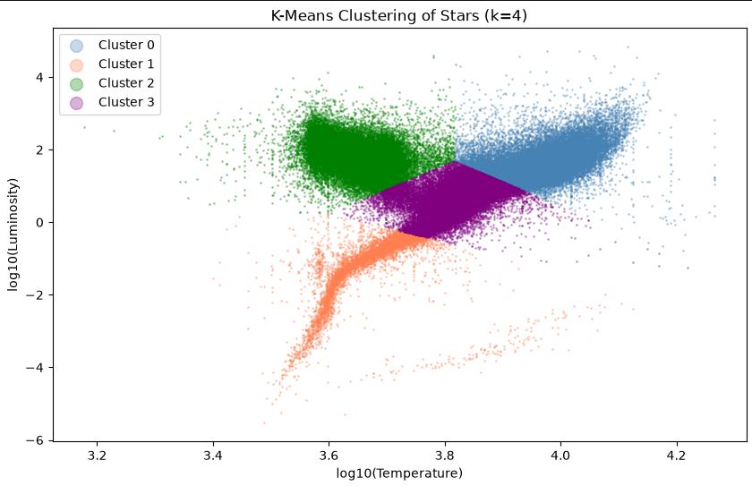

# StellarStats

A statistical analysis of stellar properties using the HYG Star Database
(v4.2), a catalog of approximately 120,000 stars compiled from the
Hipparcos, Yale, and Gliese catalogs. This project was built to explore
the intersection of astrophysics and data science, using real astronomical
data to apply statistical methods ranging from distribution analysis to
machine learning.



[View Interactive HR Diagram →](https://chenul-gomes.github.io/StellarStats/hr_diagram.html)

---

## Dataset

**Source:** HYG Star Database v4.2 — github.com/astronexus/HYG-Database  
**Size:** 119,626 stars, 37 features  
**Key properties used:** luminosity, temperature (derived from B-V colour
index), absolute magnitude, spectral classification, distance

After cleaning (removing sentinel distance values and missing colour index
entries), the working dataset contained 107,859 stars.

---

## Methods

Analysis was conducted across six Jupyter notebooks, run in order:

1. **Exploratory Data Analysis** — data loading, cleaning, validation, and derivation of temperature from the B-V colour index formula
2. **Statistical Distributions** — normality testing using the Shapiro-Wilk test, log transformations, and distribution fitting
3. **Hypothesis Testing** — comparison of stellar populations using both parametric (t-test) and non-parametric (Mann-Whitney U) tests
4. **Regression Analysis** — linear regression on log-transformed temperature and luminosity to model the temperature-luminosity relationship on the main sequence
5. **Clustering** — K-Means clustering with elbow method to rediscover stellar populations from unlabelled data
6. **HR Diagram** — interactive Hertzsprung-Russell diagram built with Plotly, colour coded by stellar temperature

---

## Key Findings

- **Distributions:** Stellar luminosity follows an approximately log-normal distribution. Temperature and colour index are both bimodal, reflecting two distinct stellar populations along the main sequence.

- **Hypothesis Testing:** Giants are significantly more luminous and cooler than main sequence stars, consistent with their expanded outer layers and position in the upper right of the HR diagram. Both parametric and non-parametric tests returned p-values of essentially zero, making this conclusion robust.

- **Regression:** The log-log linear regression captures the core temperature-luminosity relationship on the main sequence with an R² of 0.63. The observed slope of 6.18 exceeds the theoretical Stefan-Boltzmann prediction of 4, reflecting the additional influence of the mass-luminosity relationship.



- **Clustering:** K-Means with k=4 rediscovered stellar populations from unlabelled data. The most interesting finding was that the algorithm subdivided the main sequence into three temperature zones rather than treating it as a single population, independently confirming the bimodal temperature distribution found in notebook 02.



---

## Tech Stack

- **pandas** — data loading, cleaning, and manipulation
- **numpy** — numerical computation and log transformations
- **matplotlib / seaborn** — statistical visualizations and distribution plots
- **plotly** — interactive HR diagram
- **scipy** — Shapiro-Wilk normality test, t-test, Mann-Whitney U test
- **scikit-learn** — linear regression and K-Means clustering
- **jupyterlab** — notebook environment

---

## How to Run

1. Clone the repository:

```bash
git clone https://github.com/Chenul-Gomes/StellarStats.git
```

2. Create and activate a virtual environment:

```bash
python -m venv .venv
.venv\Scripts\activate
```

3. Install dependencies:

```bash
pip install -r requirements.txt
```

4. Download `hyg_v42.csv` from the HYG Database and place it in `data/`

5. Register the Jupyter kernel:

```bash
python -m ipykernel install --user --name=stellarstats --display-name "StellarStats"
```

6. Launch JupyterLab and run notebooks in order starting with `01_EDA.ipynb`:

```bash
jupyter lab
```

---

## Author

Chenul Gomes — Astrophysics student at university in Ottawa, Canada  
github.com/Chenul-Gomes